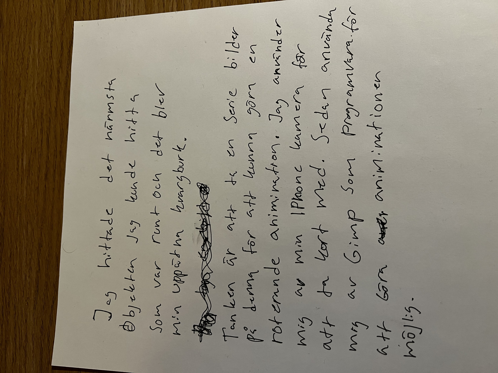
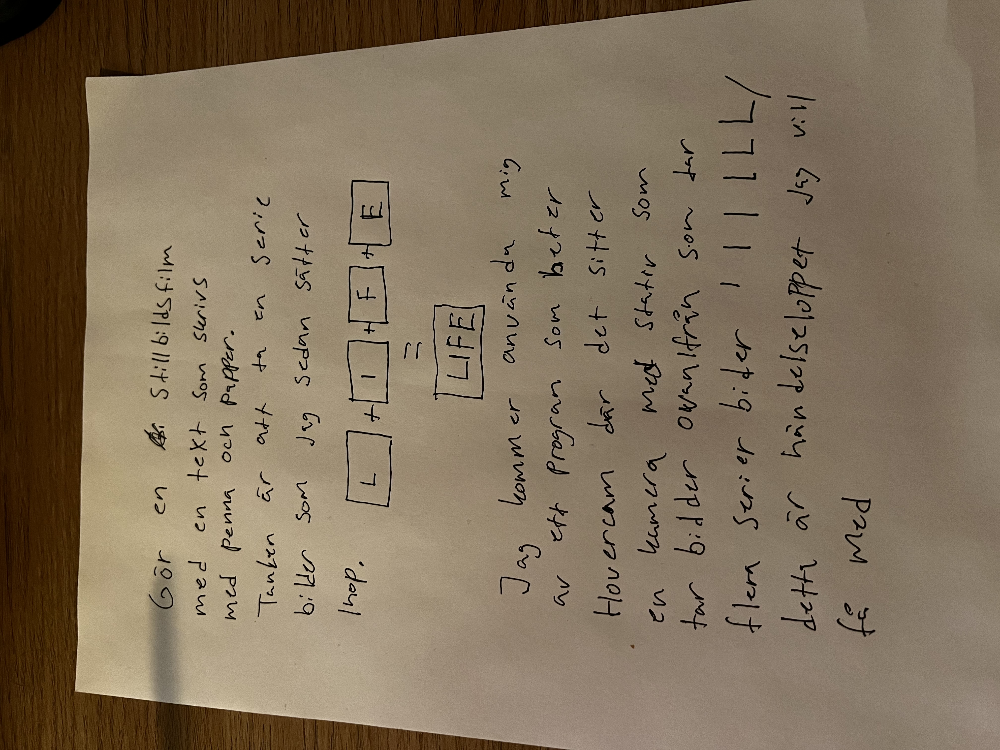
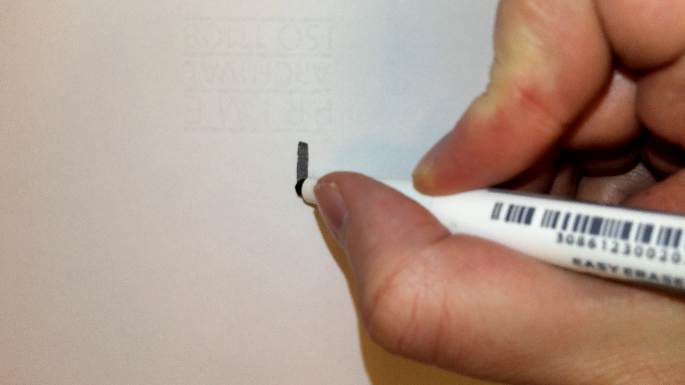
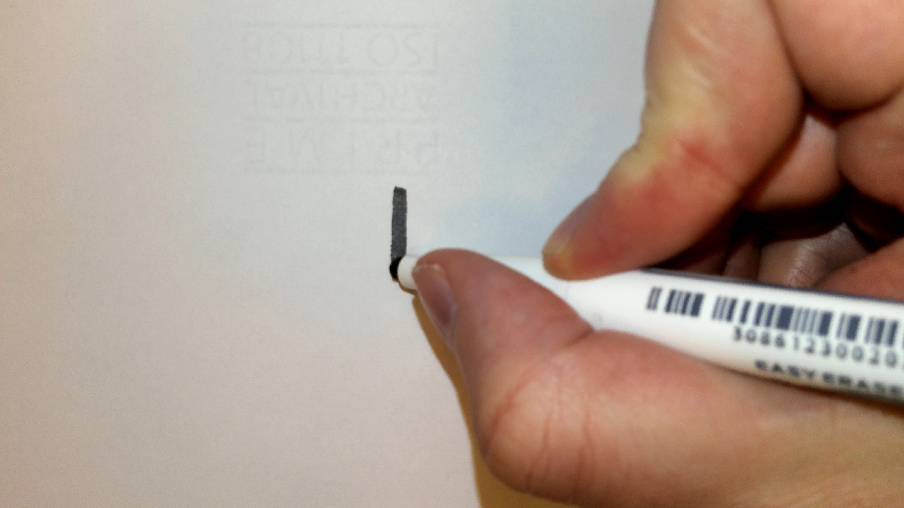
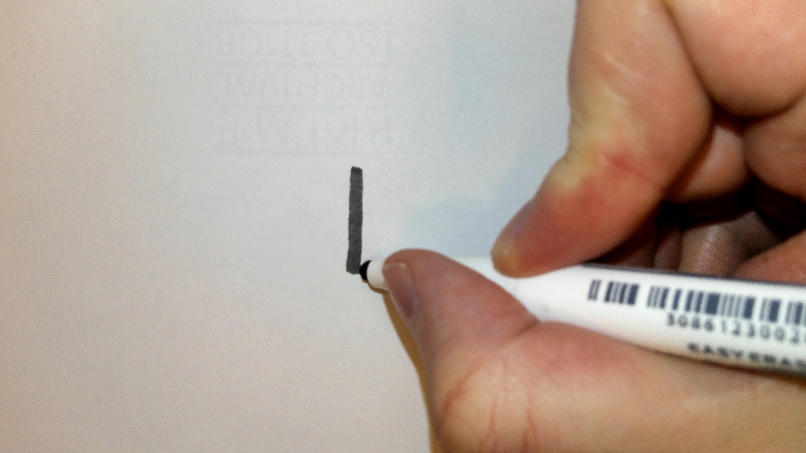
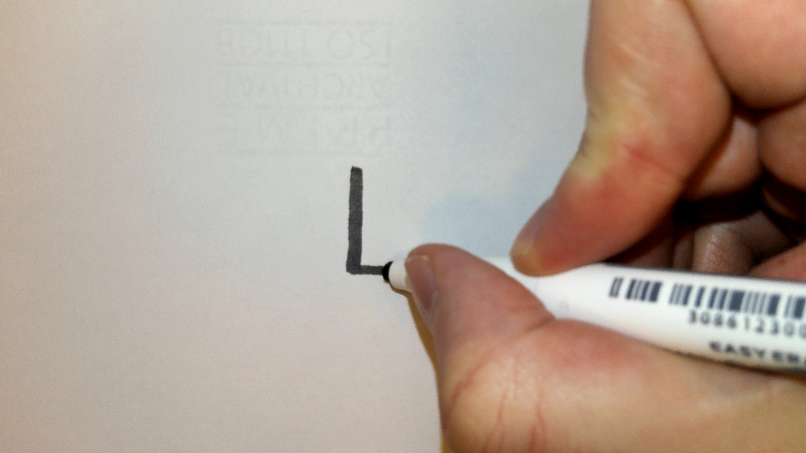
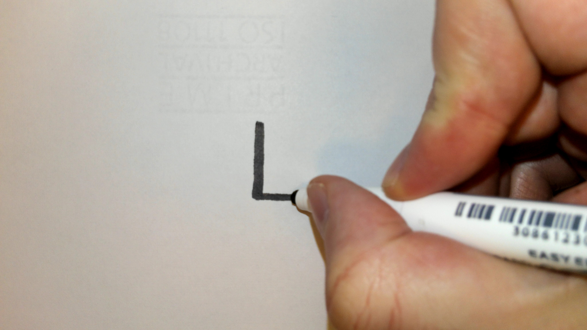
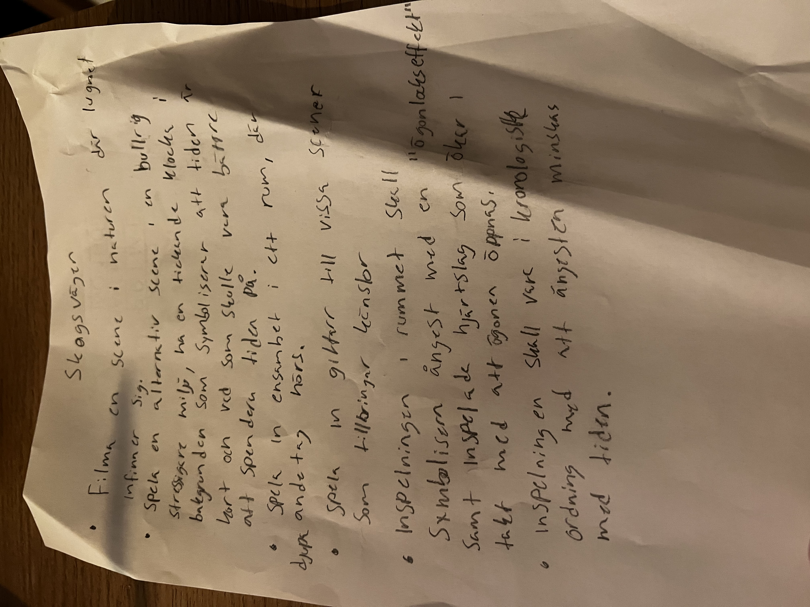

### REDOGÖR FÖR DIN SKAPANDEPROCESS

#### Kvargen

Andra gif filen som jag har på våran gemsamma sida (kvargen)
tänkte jag att jag ville göra något roterande objekt likt den vi blev 
visade under lektionstid. Där hade Leo gjort en gif animation av en trocadero burk.

Min första tanke var att ta en serie bilder och lägga upp dessa
som en rörlig gif i programmet gimp, där jag kan animera objekten. 
Jag fick i efterhand ändra i vilken ordning dessa bilder kom,
jag fick dessutom ett problem med sista bilden i serien
som gjorde att den roterande kvargen fick ett hopp emellan bilderna
som jag sedan tog bort och gjorde om. Tyvärr har jag inga utkast 
av denna gif animationen då det var ganska straight forward.

mitt uttryck av denna gifen ska symbolisera någon form av reklam, 
där kvargen står i centrum för att påtala ett ha begär.

#### Life - Stopmotion

Min inspiration kom först från att göra en längre film med
olika delar, ljud bild och video. Tyvärr kände jag med denna
kursen att jag inte skulle hinna med detta då jag suttit
fast på programmeringen, så det blev tyvärr inget
mer än detta. Kände verkligen att detta var min kurs. 
Life momentet skulle vara ett intro på det jag skulle göra från
början som jag kommer länka till senare där jag förklarar min vision.

Mitt uttryck för denna stop motion
är hur skört livet kan vara, men också hur frustrerande livet
kan vara emellanåt. 

### Genomförande

#### Kvargen

Tyvärr har jag inget utkast från detta projektet.
Det var en serie bilder på 16st varav en fick jag ta bort
som förstörde rotationen på slutet. 

#### Stop Motion

Jag använde mig av Leos stativ för att ta bildserier
ovaninfrån med hjälp av ett stativ som hade en fastmonterad
webkamera. Jag tog dessa bilder i korta intervaller för
att få fram en stopmotion som rullade på med skrift. 

Jag använde mig av hovercam till stativet för att ta
bilderna och shotcut för att skapa en stopmotion.

Bildspelet blev snabbt mot slutet då jag knycklar ihop
pappret och då la jag till några millisekunders delay
för att få det se enhetligt ut.

Här är bilder som är utkast från denna skapelse
som är med på skapelseprocessen jag skrivit ner för
att förtydliga hur jag gick vidare.

### Resultat/utvärdering

Jag tycker slutresultatet speciellt för 
stop motion klippet blev väldigt bra, jag hade velat göra
så mycket mer än vad jag hunnit göra, såg fram emot denna
kursen väldigt mycket och hade väldigt stora visioner.
Jag gillar kreativt skapande och kommer fortsätta med
detta på min fritid. Att ha Leo som lärare gjorde denna kursen
underbar!

Jag länkar med visionen jag hade med från början

Det finns saker jag hade kunnat förbättra
ett av de hade kanske varit att ha något ljudklipp
till filmen som fångar in en lite. Känslan med själva
klippet kanske hade kommit fram lite mer naturligt. 

Kvargen kunde jag haft en annan bakgrund till, så det hade
sett lite mer professionellt ut, istället för direkt på
skrivbordet med ful bakgrund.

### Digitala presentationsvägar

1. Youtube
2. Facebook
3. Instagram
4. Twitter

Jag väljer Youtube som plattform just eftersom det
är ett videoklipp. Dock är det svårt att
nå ut till en större publik med lite subscribers.
Hade man kunnat marknadsföra detta på något sätt kanske det
have varit enklare. Använde man Facebook och delade med
sina vänner kanske man hade fått en tidigare initial boost
till sina youtube kanal, så de hade funkat bra ihop. 

